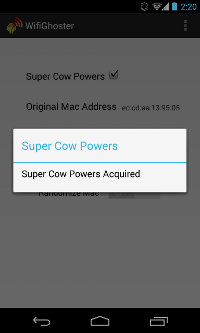

Automated WiFi Anonymizer
=========================

Automated WiFi Anonymizer randomizes the MAC address of your wireless device before establishing a connection to an access point and after disconnecting to enhance your anonymity and avoid being tracked. Requires rooted device.

Setup
-----
    Grant root privileges
    Correct interface name, if necessary (default wlan0)
    Switch on the Automatic MAC Address Randomization

Enjoy anonymous wireless access. Each time you turn on/off, connect and disconnect from a wireless access point Automated WiFi Anonymizer will change your MAC Address.
If you want to recover the original MAC Address you can press the "Recover MAC" button or switch off the automatic randomization button. The original MAC backup will then be restored.

Bugs & Contact
-----
Feel free to mail me with any problem, bug, suggestions or fixes at:
Guifre Ruiz <guifre.ruiz@owasp.org>

License
-------
Code licensed under the GPL v3.0.